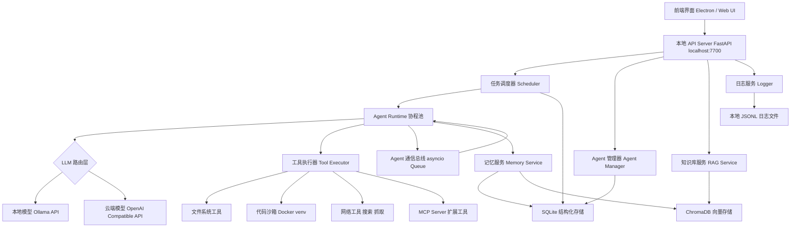

以下是完整的本地多 Agent 协同数字员工系统 PRD 文档。

---

# **数字员工系统 PRD**
**产品名称：** DigitalCrew（暂定）
**文档版本：** v1.0
**最后更新：** 2026-05-01
**文档状态：** 草稿

---

## **一、文档说明**

### **1.1 文档目的**

本文档面向产品、设计、研发及测试团队，完整描述"数字员工系统"的产品背景、用户需求、功能规格、交互逻辑与技术约束，作为各团队协作的唯一权威参考。

### **1.2 术语定义**

| 术语 | 定义 |
|------|------|
| Agent | 具备独立目标、工具调用能力和记忆的 AI 执行单元，即"数字员工" |
| 主管 Agent | 负责任务拆解与子任务分发的协调型 Agent（Supervisor） |
| 执行 Agent | 负责完成具体子任务的专能型 Agent（Worker） |
| Pipeline | 用户手动编排的多 Agent 串行/并行工作流 |
| 本地模型 | 运行在用户设备上的开源 LLM，通过 Ollama 等工具驱动 |
| 工作目录 | 系统在用户本地文件系统中的专属数据存储根目录 |
| 工具 | Agent 可调用的外部能力模块，如搜索、代码执行、文件读写等 |
| MCP | Model Context Protocol，Agent 工具调用的开放标准协议 |

### **1.3 文档范围**

本文档覆盖 v1.0（MVP）至 v2.0 的产品规格。v3.0 企业版特性（私有化多租户、SSO 等）另立文档。

---

## **二、产品概述**

### **2.1 产品背景**

当前市场上的 AI 助手产品（如 ChatGPT、Claude）以单轮对话为主，缺乏持续执行复杂任务的能力；而现有的 Multi-Agent 框架（如 AutoGen、LangGraph、CrewAI）门槛较高，普通用户无法直接使用。同时，随着用户隐私意识的提升，将数据上传至云端服务器的模式正在受到越来越多的质疑。

**DigitalCrew** 填补了"易用的本地多 Agent 工作台"这一市场空白。它让用户像管理真实员工一样，在自己的设备上创建、调度、协调多个 AI Agent，完成从简单问答到复杂多步骤工作流的各类任务，且所有数据完全留存在本地。

### **2.2 产品定位**

**面向个人用户与小型团队的本地优先多 Agent 协同工作台。**

- 本地运行，数据不出设备
- 多 Agent 协同，处理复杂任务
- 无需编程，可视化配置与编排
- 支持本地模型与云端 API 混合推理

### **2.3 目标用户画像**

**主要用户——效率驱动的知识工作者**

有大量重复性、信息密集型工作需要处理（如研究报告、数据整理、内容创作），熟悉基本电脑操作，对 AI 工具有一定了解，但无编程能力。核心诉求是"省时省力，数据安全"。

**次要用户——独立开发者 / 技术爱好者**

希望在本地搭建个人 AI 工作流，有能力使用 Docker 部署，愿意深度定制 Agent 配置，对开放性和可扩展性要求高。

**潜在用户——小型团队负责人**

希望将系统部署在团队内网服务器，供 3\~10 人共享使用，替代部分重复性岗位工作。

### **2.4 核心价值主张**

> "你的 AI 团队，只在你的机器上工作——雇几个数字员工，把复杂任务交出去。"

---

## **三、产品目标与成功指标**

### **3.1 阶段目标**

**v1.0 MVP（第 0\~12 周）**
完成核心闭环：用户可在本地创建并运行至少 3 个 Agent，通过主管 Agent 协同完成一个端到端的多步骤任务，支持本地模型与云端 API 两种推理模式，提供桌面安装包与 Docker Compose 两种部署方式。

**v2.0 成长期（第 13\~24 周）**
引入可视化 Pipeline 编辑器、定时任务、Agent 模板市场（本地分发）、群聊协同模式、资源监控面板，以及基础的多用户支持（面向家庭/小团队服务器场景）。

**v3.0 成熟期（第 25\~48 周）**
企业内网部署、LDAP/SSO 集成、细粒度权限管控、审计合规日志导出、Agent 能力评估体系。

### **3.2 关键成功指标**

| 指标 | v1.0 目标 | v2.0 目标 |
|------|-----------|-----------|
| 安装成功率 | ≥ 90% | ≥ 95% |
| 首次任务完成率 | ≥ 75% | ≥ 85% |
| 7 日留存率 | ≥ 35% | ≥ 50% |
| 平均单次任务 Agent 协作数 | ≥ 2 | ≥ 3 |
| 本地模型使用占比 | ≥ 40% | ≥ 60% |
| 用户 NPS | ≥ 30 | ≥ 50 |

---

## **四、用户场景与核心用户故事**

### **4.1 场景一：竞品调研报告生成**

用户向主管 Agent 发出指令："帮我做一份关于国内 AI 写作工具的竞品分析报告"。主管 Agent 将任务拆解为三个子任务，分别分配给搜索 Agent（收集竞品信息）、分析 Agent（整理数据对比）和写作 Agent（生成报告正文）。三个 Agent 部分并行执行，最终由主管 Agent 汇总输出一份结构完整的 Markdown 报告，保存至用户本地工作目录。整个过程用户无需干预，约 3\~8 分钟完成。

### **4.2 场景二：本地文档知识库问答**

用户将公司内部的产品手册、合同模板、FAQ 文档导入系统，系统自动对文档进行 Embedding 并存入本地向量数据库。此后用户可以向 Agent 提问，Agent 通过 RAG 检索相关段落后给出精准回答，所有文档数据始终留存在本地，不上传任何服务器。

### **4.3 场景三：定时数据监控与播报**

用户配置一个 Pipeline：每天早上 8 点，"数据采集 Agent"自动抓取指定网页的数据，"分析 Agent"生成日报摘要，"通知 Agent"将摘要以桌面通知或本地文件形式推送给用户。整个流程无人值守，定时自动运行。

### **4.4 场景四：代码辅助与自动化脚本**

用户向 Agent 描述需求："帮我写一个 Python 脚本，批量重命名当前目录下所有图片文件，按日期排序"。Agent 生成代码后，在本地沙箱环境中试运行并验证，确认无误后提示用户授权在指定目录执行，输出执行结果日志。

---

## **五、功能需求规格**

### **5.1 Agent 管理模块**

#### **5.1.1 Agent 创建与配置**

用户可通过两种方式获得 Agent：从本地 Agent 模板库一键实例化，或从零手动创建。每个 Agent 的配置项包含以下内容：

**基本信息**：名称（必填，最长 20 字符）、头像（系统预设图标或用户上传图片）、职位描述（用于界面展示，最长 50 字符）、标签（多选，用于分类检索）。

**模型配置**：底层推理模型选择（本地模型列表自动从 Ollama 同步；云端模型需用户填入 API Key 与 Base URL）、上下文窗口长度、Temperature、Top-P、最大输出 Token 数。不同 Agent 可独立配置不同模型。

**角色指令（System Prompt）**：自由文本编辑区，支持变量占位符（如 `{{current_date}}`、`{{user_name}}`），系统在执行时自动填充。提供官方预设 Prompt 模板库供用户参考。

**工具权限**：勾选式授权，每个工具的权限独立配置（详见 5.4 工具模块）。工具权限变更需用户在设置页手动保存，不允许 Agent 自行修改自身权限。

**记忆设置**：是否启用情景记忆（历史任务摘要）、是否启用知识记忆（RAG 检索），以及绑定的知识库。

#### **5.1.2 Agent 状态管理**

每个 Agent 存在以下运行状态，状态变更实时反映在工作台界面：

- **空闲（Idle）**：无任务，等待分配
- **执行中（Running）**：正在处理任务，显示当前步骤与进度
- **等待中（Waiting）**：等待其他 Agent 的输出或用户确认
- **暂停（Paused）**：用户手动暂停，保留当前上下文
- **错误（Error）**：执行异常，显示错误摘要，等待用户处置

用户可对任意 Agent 执行以下操作：启动、暂停、恢复、强制终止、查看实时日志、清空记忆。

#### **5.1.3 Agent 删除与归档**

删除 Agent 前系统弹出二次确认弹窗，明确告知将删除的数据范围（配置、记忆、任务历史）。支持"归档"操作，归档后的 Agent 不再出现在工作台但配置与历史保留，可随时恢复。

---

### **5.2 任务系统模块**

#### **5.2.1 即时任务**

用户在对话面板输入自然语言指令，系统判断是单 Agent 处理还是需要主管 Agent 介入并分发。即时任务的生命周期：`创建 → 分配 → 执行中 → 完成 / 失败`。

任务执行过程中，界面实时展示 Agent 的思考步骤（ReAct 链路）：每一步的思考（Thought）、行动（Action）、工具调用参数、工具返回结果（Observation）均以折叠卡片形式展示，用户可展开查看详情。

#### **5.2.2 定时任务（v2.0）**

用户可为任意 Pipeline 或单个 Agent 配置触发时间，支持以下两种输入方式：

- **自然语言输入**：如"每天早上 9 点"、"每周一上午 10 点"，系统自动解析为 Cron 表达式并展示供用户确认
- **Cron 表达式直接输入**：面向高级用户，提供 Cron 语法提示

定时任务支持启用/禁用开关，以及执行历史查看（最近 30 次执行记录，含状态与输出摘要）。

#### **5.2.3 任务历史与回放**

所有任务均持久化存储在本地 SQLite 数据库，用户可在任务中心查看完整历史。每条任务记录包含：任务描述、发起时间、完成时间、参与 Agent 列表、最终输出、完整执行链路日志。

支持"回放"功能：用户可查看任务执行的完整 ReAct 链路，逐步追溯 Agent 的每一个决策与工具调用，便于理解和调试。

#### **5.2.4 任务中断与人工介入**

流程执行过程中，用户可随时点击"介入"按钮暂停当前任务，向 Agent 补充指令或修正方向后继续执行。对于涉及敏感操作（如删除文件、发送外部请求）的工具调用，系统默认在执行前弹出确认对话框，用户可选择"允许本次"、"始终允许"或"拒绝"。

---

### **5.3 多 Agent 协同模块**

#### **5.3.1 主管模式（Supervisor Mode）**

主管 Agent 是协同工作的核心枢纽，其工作流程如下：

**任务接收**：接收用户的高层目标描述，结合当前可用 Agent 列表与各 Agent 的能力描述，制定执行计划。

**任务拆解**：将目标分解为若干子任务，每个子任务包含：任务描述、期望输出格式、分配目标 Agent、依赖关系（前置子任务 ID）、超时时间。

**动态调度**：根据依赖关系确定执行顺序，无依赖的子任务并行执行，有依赖的子任务等待前置完成后触发。若某个 Agent 执行失败，主管 Agent 可选择重试、换其他 Agent 重新执行或向用户上报。

**结果整合**：收集所有子任务输出，进行摘要、格式化或进一步加工，形成最终结果返回给用户。

主管 Agent 本身也是一个可配置的 Agent，用户可自定义其 System Prompt 以调整调度风格（如"保守型：每步执行前确认"vs"自主型：全程自动执行"）。

#### **5.3.2 Pipeline 模式（v2.0）**

用户通过可视化画布构建工作流，画布基于节点-连线模型，支持以下节点类型：

- **Agent 节点**：代表一个 Agent 的执行单元，配置输入变量映射与输出变量命名
- **条件分支节点**：根据上游 Agent 输出的内容判断走向（支持关键词匹配与 LLM 语义判断两种条件类型）
- **并行节点**：将流程分叉为多个并行分支
- **汇聚节点**：等待所有并行分支完成后合并结果
- **触发节点**：定时触发或外部事件触发（如文件变更、HTTP Webhook）
- **输出节点**：将最终结果写入文件、发送桌面通知或触发其他 Pipeline

画布操作支持：拖拽创建节点、连线建立依赖、双击编辑节点配置、右键菜单、撤销/重做、缩放与全屏、导出为 JSON 格式。

#### **5.3.3 群聊模式（Swarm，v2.0）**

多个 Agent 共享一个对话上下文，以"圆桌会议"形式协作。系统内置一个轻量级的发言权调度机制：每轮对话结束后，由当前发言 Agent 决定下一个发言 Agent（通过在输出中指定 `next_agent` 字段），或由用户手动点击某个 Agent 的头像指定其发言。

群聊模式适合开放性探讨任务，如头脑风暴、多角色评审、辩论推演等。用户可设置最大轮次上限，防止 Agent 之间无限循环。

---

### **5.4 工具模块**

工具是 Agent 与外部世界交互的接口，系统内置以下工具，均可在本地离线运行（网络相关工具需联网）：

#### **5.4.1 内置工具清单**

**文件系统工具**：读取文件（支持 TXT、PDF、Word、Excel、Markdown、CSV）、写入/追加文件、列出目录内容、创建/删除目录。操作范围限定在用户授权的目录白名单内，默认为工作目录下的 `workspace/` 子目录。

**代码执行工具**：在本地 Python 沙箱（Docker 容器或 venv 隔离环境）中执行代码，返回标准输出与错误信息。支持安装临时依赖包（pip install），容器在任务结束后自动销毁。执行超时默认 60 秒，可配置。

**网络搜索工具**：调用本地配置的搜索 API（支持 Tavily、SerpAPI、Bing Search API 等，用户自持 Key），返回搜索结果摘要与来源链接。

**网页抓取工具**：抓取指定 URL 的页面内容，转换为 Markdown 格式供 Agent 阅读，支持 JavaScript 渲染（基于本地 Playwright）。

**知识库检索工具**：在用户指定的本地知识库（向量数据库）中进行语义检索，返回 Top-K 相关段落及来源文件信息。

**系统命令工具（高危，默认禁用）**：执行本地 Shell 命令，需用户在设置中显式开启，且每次调用均需用户二次确认。

**桌面通知工具**：向用户操作系统发送桌面通知，显示标题与内容摘要。

#### **5.4.2 MCP 工具扩展**

系统支持 MCP（Model Context Protocol）标准，用户可通过配置文件注册第三方 MCP Server，扩展 Agent 可调用的工具范围。系统在启动时自动发现并加载已配置的 MCP Server，在工具列表中展示其提供的工具能力，Agent 可像使用内置工具一样调用它们。

---

### **5.5 记忆与知识库模块**

#### **5.5.1 三层记忆架构**

**工作记忆**：即当前任务的 LLM 上下文窗口，随任务结束自动清空，完全在内存中运行，不持久化。

**情景记忆**：任务完成后，系统自动生成该任务的执行摘要（包含目标、关键步骤、最终结论），以结构化格式写入 SQLite。Agent 在接收新任务时可检索历史相似任务的摘要，利用过往经验优化当前执行策略。用户可手动删除特定记忆条目，或一键清空某个 Agent 的全部历史记忆。

**知识记忆（知识库）**：用户主动上传文档或指定本地目录，系统自动完成文档解析、分块（Chunking）、Embedding 计算，并将向量存入本地 ChromaDB 或 LanceDB。支持增量更新（监听目录变更自动重新索引）。Agent 通过 RAG 检索时，返回相关度最高的 Top-K 段落及来源文件与页码。

#### **5.5.2 知识库管理界面**

提供独立的知识库管理页面，用户可查看已索引的文档列表（文件名、大小、索引时间、chunk 数量）、手动触发重新索引、删除特定文档、查看 Embedding 模型配置。

Embedding 模型支持本地运行（推荐 `nomic-embed-text` 或 `bge-m3`，通过 Ollama 调用）和云端 API（OpenAI text-embedding-3-small 等），用户可独立配置，与推理模型解耦。

---

### **5.6 用户工作台（主界面）**

工作台是用户与系统交互的核心界面，采用左侧导航 + 主内容区的经典布局。

#### **5.6.1 我的团队（Team Overview）**

以卡片网格形式展示当前所有 Agent，每张卡片显示：Agent 头像与名称、当前状态（颜色标识）、当前任务描述（若执行中）、今日完成任务数、绑定模型名称。点击卡片进入 Agent 详情页，可查看配置、记忆、历史任务。支持拖拽排序与分组管理。

#### **5.6.2 对话面板（Chat Panel）**

支持两种对话模式：

**单 Agent 对话**：直接与某个 Agent 一对一交流，适合简单任务与测试。

**团队对话**：与主管 Agent 对话，主管 Agent 自动协调其他 Agent 完成任务。用户可通过 `@Agent名称` 语法在对话中直接指定某个 Agent 执行特定子任务。

对话面板实时展示消息流，包括用户消息、Agent 回复、Agent 的思考步骤（可折叠）、工具调用记录（显示工具名、入参摘要、返回结果摘要）。支持消息复制、任务结果导出为文件。

#### **5.6.3 任务中心（Task Center）**

任务列表支持按状态（全部/执行中/已完成/失败）、Agent、时间范围筛选与搜索。每条任务记录可展开查看完整执行链路，支持"重新执行"（复用相同参数重新触发）与"导出日志"操作。

#### **5.6.4 资源监控面板（Resource Monitor）**

实时展示本地系统资源占用：CPU 使用率、内存使用量、GPU 显存占用（若有）、各 Agent 进程的资源占用明细、本地模型推理速度（tokens/s）、工作目录磁盘占用。当资源使用超过阈值时（可配置）发出桌面警告通知。

#### **5.6.5 设置页（Settings）**

设置页分为以下几个模块：

**模型配置**：管理本地模型列表（从 Ollama 同步）与云端 API 配置（Key、Base URL、可用模型列表），支持连通性测试。

**工具配置**：各工具的全局开关、权限级别设置、API Key 配置（搜索工具等）、沙箱超时时间。

**工作目录**：查看与修改系统工作目录路径，查看各子目录占用大小，提供一键清理缓存功能。

**隐私设置**：是否开启匿名使用统计（默认关闭）、是否开启自动错误报告（默认关闭）。

**备份与恢复**：导出完整配置（Agent 配置、Pipeline、知识库索引元数据）为 ZIP 压缩包；从备份文件恢复；配置 WebDAV 自动备份（可选）。

**关于**：版本信息、更新日志、开源许可证声明。

---

### **5.7 Agent 模板市场（v2.0）**

模板市场采用**本地优先的分发模式**，不依赖中心化服务器运行 Agent。

官方维护一个公开的 Git 仓库作为模板注册表，每个 Agent 模板以标准 YAML 格式描述其配置（名称、描述、System Prompt、所需工具、推荐模型、标签）。用户在市场页面浏览时，系统从注册表拉取元数据展示；用户点击"安装"后，模板配置下载到本地并实例化为 Agent，此后完全在本地运行，不依赖任何外部服务。

社区用户可通过提交 Pull Request 的方式向官方仓库贡献模板，经审核后上架。

---

## **六、非功能需求**

### **6.1 性能要求**

| 指标 | 要求 |
|------|------|
| 即时任务首字响应时间（本地模型） | ≤ 5 秒（P95，取决于模型大小） |
| 即时任务首字响应时间（云端 API） | ≤ 2 秒（P95） |
| 最大并发 Agent 数量 | ≥ 5 个（8GB RAM 环境） |
| 知识库文档索引速度 | ≥ 10 页/秒（本地 Embedding） |
| 界面操作响应时间 | ≤ 200ms（P95） |
| 系统启动时间 | ≤ 10 秒（冷启动） |

### **6.2 兼容性要求**

**操作系统**：Windows 10/11（x64）、macOS 12+（Intel & Apple Silicon）、Ubuntu 20.04+（x64）。

**硬件最低配置**：8GB RAM、10GB 可用磁盘空间、4 核 CPU。运行本地模型推荐 16GB RAM 及以上，有 GPU 的设备可显著提升推理速度。

**浏览器（Web UI 模式）**：Chrome 110+、Firefox 110+、Edge 110+、Safari 16+。

### **6.3 可靠性要求**

- Agent 执行崩溃后自动重启，并记录崩溃日志，不影响其他 Agent 的运行
- 任务执行状态持久化，系统意外重启后可恢复未完成任务的状态（而非重新执行）
- 本地数据库每日自动备份一份（保留最近 7 天），防止数据损坏丢失
- 所有用户配置变更实时写入磁盘，不因进程崩溃丢失

### **6.4 安全要求**

- Agent 的文件系统访问严格限定在授权目录白名单内，禁止访问系统目录（如 `C:\Windows`、`/etc`、`/sys`）
- 代码执行工具在隔离沙箱中运行，沙箱内无法访问宿主机网络（可配置例外）
- 用户 API Key 使用操作系统密钥链（Keychain / Credential Manager）加密存储，不以明文写入配置文件
- 本地 Web UI 仅监听 `127.0.0.1`，不对外网暴露（多用户服务器部署模式下需用户手动配置反向代理并启用认证）

### **6.5 可观测性要求**

- 每次 Agent 执行均生成完整的结构化日志，包含：时间戳、Agent ID、任务 ID、每步 ReAct 链路、工具调用详情、token 用量、耗时
- 日志以 JSONL 格式持久化存储在本地，支持按时间范围导出
- 提供日志查看界面，支持关键词搜索与级别过滤（INFO / WARNING / ERROR）

---

## **七、系统架构设计**

### **7.1 整体架构**



### **7.2 技术选型**

| 模块 | 技术方案 | 选型理由 |
|------|----------|----------|
| 后端框架 | Python + FastAPI | 异步支持好，AI 生态丰富，与 LangChain/LangGraph 无缝集成 |
| Agent 编排 | LangGraph | 支持有状态的多 Agent 工作流，原生支持 ReAct、Supervisor 等模式 |
| 前端框架 | React + TypeScript | 生态成熟，组件库丰富 |
| 桌面封装 | Electron | 跨平台，可内嵌本地服务进程 |
| Pipeline 画布 | ReactFlow | 专为节点编辑器设计，社区活跃 |
| 结构化数据库 | SQLite + SQLAlchemy | 零配置，单文件，适合本地场景 |
| 向量数据库 | ChromaDB | 纯 Python，无需额外服务，本地持久化 |
| 本地模型驱动 | Ollama | 跨平台，模型管理简单，兼容 OpenAI API 格式 |
| 代码沙箱 | Docker（优先）/ Python venv（降级） | Docker 隔离性强；无 Docker 环境降级为 venv |
| 网页抓取 | Playwright（Python） | 支持 JS 渲染，跨平台 |
| 工具扩展协议 | MCP（Model Context Protocol） | 开放标准，生态快速增长 |

### **7.3 数据存储结构**

系统工作目录默认为 `~/DigitalCrew/`，目录结构如下：

```
~/DigitalCrew/
├── config/
│   ├── agents/          # Agent 配置文件（每个 Agent 一个 YAML）
│   ├── pipelines/       # Pipeline 配置文件
│   └── settings.yaml    # 全局系统配置
├── data/
│   ├── db.sqlite        # 主数据库（任务历史、记忆摘要等）
│   └── vectordb/        # ChromaDB 向量数据文件
├── workspace/           # Agent 默认工作目录（文件读写沙箱）
├── knowledge/           # 用户上传的知识库原始文档
├── logs/                # 系统与任务执行日志（JSONL）
└── backups/             # 自动备份文件
```

---

## **八、交互设计规范**

### **8.1 设计原则**

**透明可控**：Agent 的每一步行动对用户可见，用户随时可以介入、暂停或终止，不存在"黑盒执行"。

**渐进披露**：默认展示简洁的任务进度与结果，技术细节（ReAct 链路、工具参数、Token 用量）通过折叠展开的方式按需呈现，不干扰普通用户。

**本地感知**：界面设计应持续强化"本地运行"的安全感，如在关键位置展示"本地运行中"状态标识，数据存储路径清晰可见。

**容错友好**：Agent 出错时提供清晰的错误说明与建议操作，而非仅展示技术报错信息。

### **8.2 关键交互流程**

**新用户首次启动流程**：

1. 欢迎页展示产品核心价值，进入引导向导
2. 检测本地环境（Ollama 是否安装、GPU 情况），展示检测结果
3. 引导用户选择推理模式：纯本地 / 云端 API / 混合
4. 若选择本地模型，引导下载推荐模型（展示模型大小与预计下载时间）
5. 若选择云端 API，引导填入 API Key 并测试连通性
6. 自动创建默认主管 Agent 与 2 个示例执行 Agent
7. 展示示例任务演示，用户可直接运行体验协同效果
8. 进入工作台主界面

**Agent 执行任务时的确认交互**：

当 Agent 即将执行高风险操作时（如写入文件、执行系统命令、发起网络请求），弹出确认对话框，清晰展示：将要执行的操作描述、涉及的具体参数（如目标文件路径）、风险提示。用户可选择"允许本次"、"始终允许此类操作"或"拒绝并告知 Agent"。

---

## **九、版本规划与里程碑**

### **v1.0 MVP 功能范围（第 1\~12 周）**

- 本地安装包（Windows + macOS）与 Docker Compose 部署
- Agent 创建、配置、状态管理
- 单 Agent 对话与即时任务
- 主管模式多 Agent 协同（顺序 + 并行）
- 内置工具：文件读写、代码执行、网络搜索、网页抓取
- 三层记忆系统（工作记忆 + 情景记忆 + 基础知识库）
- 任务历史与 ReAct 链路查看
- 本地模型（Ollama）与云端 API 双模式支持
- 基础工具权限管控与敏感操作确认

### **v2.0 功能范围（第 13\~24 周）**

- 可视化 Pipeline 编辑器（含条件分支、并行汇聚）
- 定时任务（Cron）
- 群聊协同模式（Swarm）
- Agent 模板市场（基于 Git 仓库分发）
- 资源监控面板
- MCP 工具扩展支持
- 知识库管理界面增强（增量索引、多知识库）
- 基础多用户支持（用于家庭/团队服务器部署）
- 配置导出/导入与 WebDAV 备份同步
- Linux 桌面安装包支持

### **v3.0 功能范围（第 25\~48 周）**

- 企业内网多租户部署
- LDAP / SSO 集成
- 细粒度角色权限管控（RBAC）
- 审计日志合规导出
- Agent 能力评估与基准测试框架
- 私有 Agent 市场（企业内部分发）

---

## **十、开放问题与待决策项**

以下问题需产品与技术团队在启动前对齐决策：

**关于推理资源调度**：当用户同时运行多个本地模型 Agent 导致显存不足时，系统应采用排队等待、自动降级到 CPU 推理，还是自动切换到云端 API 兜底？建议提供三种策略供用户在设置中选择，默认为"排队等待"。

**关于 Agent 间上下文传递的格式标准**：多 Agent 协作时，子任务的输入输出是否应遵循统一的结构化格式（如 JSON Schema），还是允许自由文本传递？结构化格式有助于稳定性，但降低了灵活性。建议 v1.0 采用自由文本 + 可选 JSON，v2.0 引入 Schema 约束。

**关于 Electron 与纯 Web 的优先级**：Electron 安装包体积较大（约 200\~400MB），但用户体验更原生；纯 Web（配合本地服务）安装更轻量但体验略差。建议 v1.0 优先交付 Docker Compose + Web UI 版本快速验证，Electron 版本在 v1.0 后期跟进。

**关于错误处理的边界**：Agent 执行失败时，是否允许主管 Agent 自主决定重试策略（如换一个 Agent、换一种方法），还是必须上报用户确认？建议默认允许主管 Agent 自主重试一次，超过重试次数后上报用户。

---

*本文档为 v1.0 草稿，待技术评审后进入 v1.1 修订版。*
